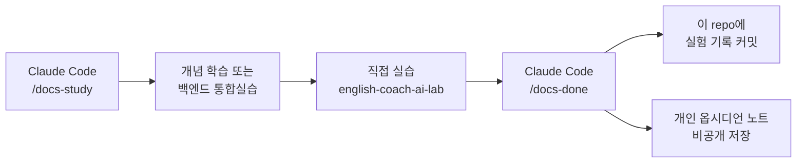

# hello-claude — AI 네이티브 역량 학습 기록

## 왜 이걸 시작했나
Claude Code 공식 문서를 처음부터 다 훑어보려다 보니 양이 너무 많았고,
"일단 다 본다"는 목표로는 오래 못 갈 것 같았습니다. 그래서 방향을 바꿨습니다.

- 문서를 순서대로 읽는 것이 아니라, **실무에서 많이 쓰는 것 위주로** 골라서 본다
- 읽고 끝나는 게 아니라 **직접 백엔드 환경(Java/Spring)에서 실험**해서 검증한다
- 반복되는 "오늘 뭐 공부하지", "공부한 걸 어디 기록하지"는 **자동화**하고,
  실제로 이해하고 판단하는 부분만 제 시간을 씁니다

즉 이 repo는 "Claude Code 사용법 정리"가 아니라, **AI가 언제 왜 작동하고 실패하는지
판단하는 능력을 백엔드 실험으로 검증한 기록**입니다.

## 어떤 흐름으로 진행하나



1. **시작**: `/docs-study` 슬래시 커맨드가 커리큘럼에서 다음 세션을 가져와
   개념 요약과 실습 과제를 제시 (매번 최신 공식 문서를 실시간으로 검색해서 반영)
2. **실습**: 직접 코드를 짜거나 판단을 정리 — 여기는 자동화하지 않음
3. **기록**: `/docs-done`이 실험 결과를 정해진 양식(가설/조건/측정/결론)으로 정리해서
   이 repo에 커밋. 세부 기능이 나중에 바뀌어도 "어떤 유형의 실험을 했는지"는 남도록,
   각 문서에 실험 유형(비교실험/파이프라인설계/평가/보안/비용실험/의사결정) 태그를 붙입니다

## 진행 현황

| Week | Session | 주제 | 실험 유형 | 기록 |
|---|---|---|---|---|
| 1 | S1 | AI 기본기 (모델/제품/도구/Agent, Token, Context Window, Hallucination) | comparison | [기록](2026-08-15-w1-comparison-hallucination-model-check.md) |
| 1 | S2 | Prompt Engineering (명확성, 예시, 출력형식 제약) | comparison | [기록](2026-08-16-w1-comparison-prompt-clarity-output-format.md) |
<!-- /docs-done 실행 시 이 아래에 자동으로 한 줄씩 추가됨 -->

## 커리큘럼 개요
4주, 20세션. 세부 항목보다 실험 유형 중심으로 구성했습니다.

- **Week 1** — AI 동작 원리와 Context (실험 유형: comparison)
- **Week 2** — Tool·Workflow·Agent 구조 (실험 유형: pipeline)
- **Week 3** — 평가(Evals)·RAG·MCP·보안 (실험 유형: evaluation, security)
- **Week 4** — 비용·Caching·비즈니스 판단 (실험 유형: cost, decision)

모든 실습은 새 프로젝트를 매번 만들지 않고, `english-coach-ai-lab` 하나를 재사용합니다.

## 문서 형식
각 실험 기록은 아래 형식을 따릅니다 (YAML 프론트매터로 실험 유형·상태를 구조화):

```markdown
---
date: 2026-08-20
week: 1
practice_type: [comparison]
topic: [prompt, context]
status: verified
---
# 실험 목적
## 가설
## 조건
## 실행 결과
## 결론
## 실제 프로젝트 적용 가능성
```

## 참고
개인 개념 노트(옵시디언용 원자 노트)와 실습 대상 프로젝트 코드는 비공개 저장소에서
별도로 관리하며, 이 repo에는 다듬어진 실험 기록만 공개합니다.
